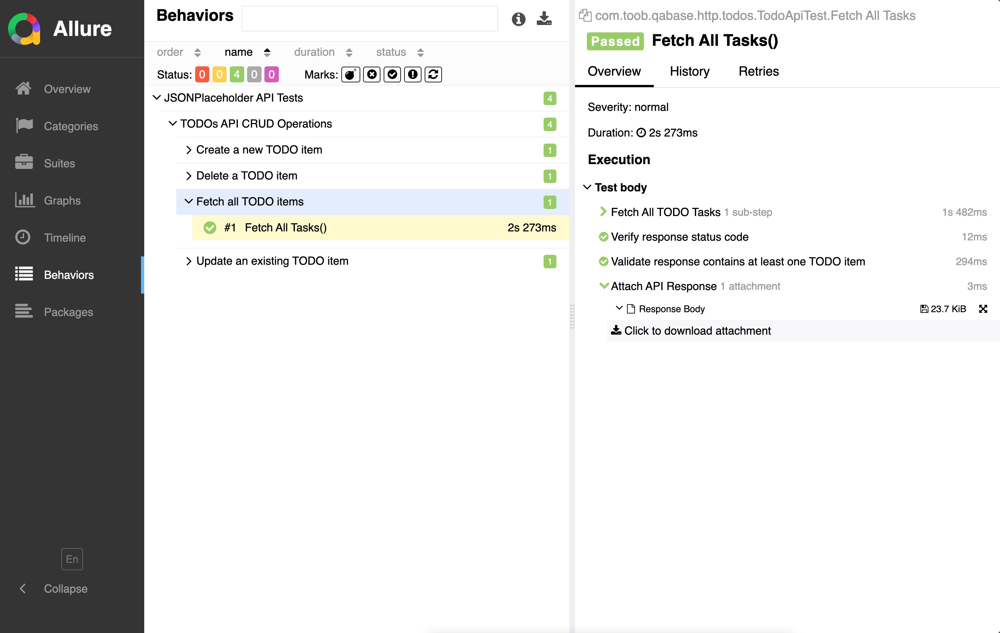

# REST API Test Automation with Spring Boot, Kotlin, JUnit, and Allure

This project provides a flexible and extensible framework for automating REST API tests using **Spring Boot**, **Kotlin**, **JUnit 5**, **REST Assured**, and **Allure Reports**. It aims to make it easy to test and validate your APIs with detailed, visually rich reports generated by Allure. This is basically a very nice, startup Template.
<br/>
<br/>

## Features

- **Spring Boot 3.4.2**: Leverages Spring Boot's robust features for creating a well-organized test suite.
- **Kotlin 2.x**: Written in Kotlin, providing concise and expressive code.
- **JUnit 5**: Modern testing framework that supports advanced features like parameterized tests and lifecycle hooks.
- **REST Assured**: Simplifies the process of sending HTTP requests and validating responses.
- **Allure Reports**: Rich, detailed test reports with attachments, screenshots, and status codes.
- **Kotlin Serialization**: Handles JSON serialization and deserialization efficiently.
<br/>
<br/>

## Getting Started

### Prerequisites

- Java 21+
- Maven
- Kotlin 2.x
- Spring Boot 3.4.2
  <br/>
  <br/>

## Setup

1. Clone the repository:

   ```bash
   git clone https://github.com/your-username/repository-name.git
   cd repository-name
   ```
2. Build the project : `mvn clean install`
3. Running the tests : `mvn clean test`
4. After running the tests, the Allure report will be generated in the target/allure-results directory. To view the report locally, use the following command : `mvn allure:serve`
   <br/>
   <br/>

## Test Case Example

Here’s an example of a simple test case that demonstrates how to use this framework to test a REST API :

```java
@Test
@Story("Create a new TODO item")
fun `Create New Task`() {
    val todo = Todo(
        userId = 1, 
        title = "My New TODO", 
        completed = false
    )

    val json = Json {
        prettyPrint = true
        ignoreUnknownKeys = true
        encodeDefaults = true
    }

    val requestBody = Json.encodeToString(todo)

    val response = step("Send POST request to create a new TODO") {
        RestClient.post("/todos", requestBody)
    }

    step("Verify response status code") {
        assertEquals(201, response.statusCode)
    }

    step("Attach response to Allure report") {
        attachResponse(response)
    }
}
```

<br/>
<br/>

## Reports Example

After running the tests, the Allure report will show:

- **Test Name:** Create a new TODO item
- **Status:** Passed

* Attachments: Response body, screenshots, and logs
  <br/>


<br/>
<br/>

## Key Points:

- **Single Flow:** All setup steps (clone the repo, build, test, and view reports) are included in one seamless section. No separate sub-sections for different steps.
- **Clear Command Flow:** The file includes all commands and steps from `mvn clean install` to generating the Allure report using `mvn allure:serve`, all presented in one continuous process.
- **Test Example:** The test case is presented in full, showcasing how to use the framework.

<br/>
<br/>
